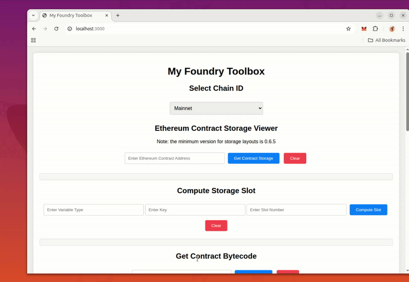
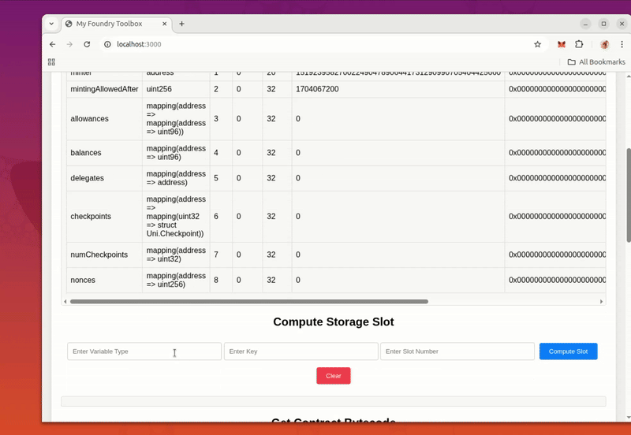
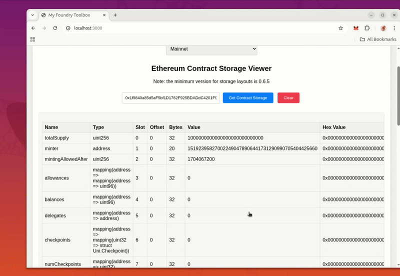

# Anvil State Generator

> ⚠️ **EXPERIMENTAL WARNING**: This tool is currently in experimental development. Some features may not work as expected, particularly with older smart contracts that use legacy compiler versions (pre-0.6.5). Storage layout inspection for these contracts fail to return results. Furthermore, the export state as json file feature is under development, so do not rely on its results

A UI toolbox for Ethereum developers that provides essential Foundry utilities for contract analysis, storage inspection, and state generation for Anvil local development.

## 🚀 Features

- **Contract Storage Viewer**: Inspect contract storage layouts and values across multiple networks
- **Storage Slot Calculator**: Compute storage slots for mapping and array variables
- **Bytecode Fetcher**: Retrieve contract bytecode from any supported network
- **Data Formatting Tools**: Convert between integers, hex values, and properly formatted data
- **Anvil State Generator**: Create complete JSON state files for local Anvil instances

## 📋 Prerequisites

- [Foundry](https://getfoundry.sh/) installed on your system -- it might work solely with npm i and the @metamask/foundry package (to test)
- Node.js and npm
- Infura API key (for RPC access)
- Etherscan API key (for storage layout verification)

## 🛠️ Manual Setup

### 1. Install Dependencies

```bash
npm install
```

### 2. Environment Configuration

Create a `.env` file in the root directory with your API keys:

```env
INFURA_PROJECT_ID=your_infura_project_id_here
ETHERSCAN_KEY=your_etherscan_api_key_here
```

### 3. Start the Server

```bash
npm run start
```

The application will be available at `http://localhost:3000`

## 🎥 Demo

### Contract Storage Inspection


Learn how to inspect contract storage layouts and retrieve storage values for any contract address across multiple networks.

### Bytecode Retrieval


See how to fetch contract bytecode and use it for local development or analysis.

### Utility Functions


Explore the data formatting utilities and storage slot computation features.

## 🔧 Supported Networks

- Ethereum Mainnet
- Linea Mainnet
- Optimism Mainnet
- Arbitrum Mainnet
- Avalanche Mainnet
- Polygon Mainnet
- Sepolia Testnet

## 📖 Usage Guide

### Contract Storage Viewer
1. Select your target network from the dropdown
2. Enter the contract address you want to inspect
3. Click "Get Contract Storage" to retrieve the storage layout
4. Use the clear button to reset the form

### Storage Slot Calculator
1. Enter the variable type (e.g., `address`, `uint256`)
2. Provide the key value for mappings
3. Specify the slot number
4. Click "Compute Slot" to get the calculated storage slot

### Bytecode Fetcher
1. Select the network where the contract is deployed
2. Enter the contract address
3. Click "Get Bytecode" to retrieve the contract's bytecode
4. Copy the bytecode for use in your local Anvil instance

### Data Formatting Tools
- **Integer to Hex**: Convert decimal numbers to hexadecimal format
- **Hex to Integer**: Convert hexadecimal values to decimal
- **Pad to 32 Bytes**: Ensure values are properly padded for storage
- **Add 18 Zeros**: Useful for converting wei to ether values

### Anvil State Generator
1. Add contracts with their addresses, bytecode, balance, and nonce
2. Configure storage key-value pairs for each contract
3. Generate the complete JSON state file
4. Download the file for use with your local Anvil instance

## 🔒 Security Notes

- Keep your API keys secure and never commit them to version control
- The tool uses Infura's public RPC endpoints for network access
- All computations are performed locally using Foundry's `cast` command

## 🤝 Contributing

Contributions are welcome! Please feel free to submit pull requests or open issues for bugs and feature requests.

## 📄 License

This project is licensed under the ISC License.

## 🚧 What's Next

### ERC20 Storage Directory
We're working on creating a comprehensive directory of storage layouts for the most common ERC20 tokens, especially those with older compiler versions that don't support modern storage layout inspection. This will include:

- **Popular ERC20 Tokens**: USDT, USDC, DAI, WETH, and other widely-used tokens
- **Legacy Contract Support**: Storage layouts for contracts compiled with older Solidity versions
- **Pre-computed Storage Slots**: Ready-to-use storage mappings for common ERC20 functions
- **Documentation**: Detailed explanations of storage patterns and slot calculations

This directory will help developers work with older contracts that don't support the `--storage-layout` flag and provide reference implementations for common token patterns.

### Planned Features
- Automated storage layout detection for legacy contracts
- Export functionality for Anvil state files with pre-configured token states 